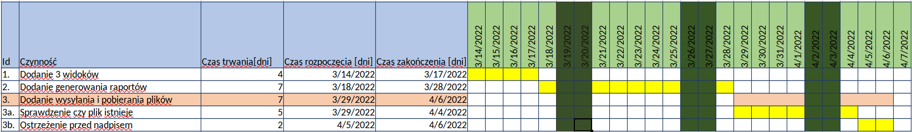
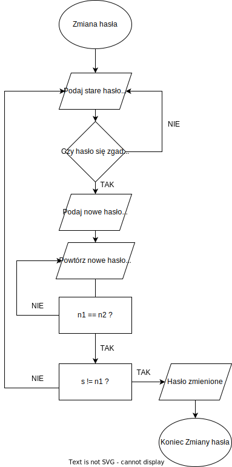
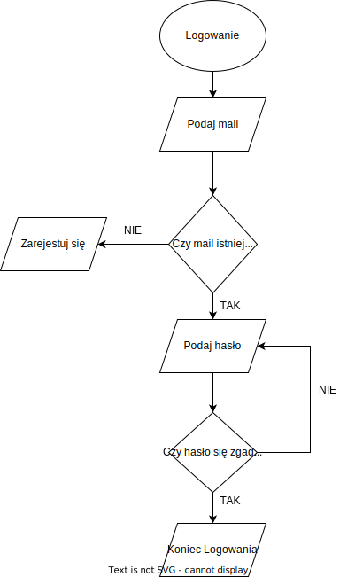
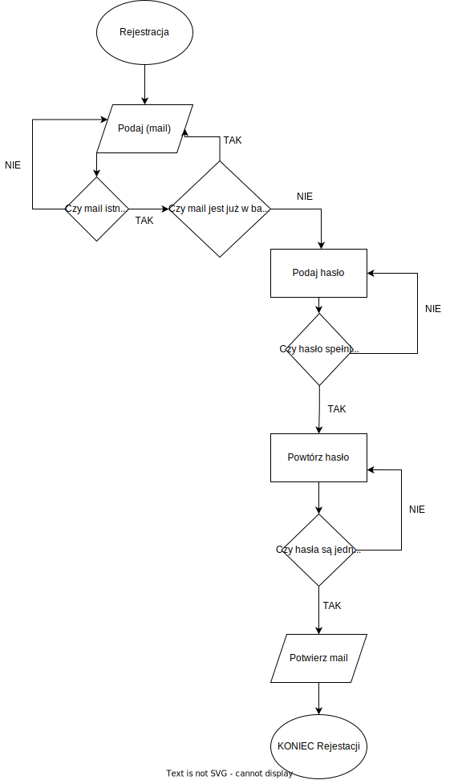

# Table of Contents

1.  [Ćwiczenia 1](#org8ad88af)
    1.  [Dokumentacja projektu](#orgd9c0a87)
    2.  [Projekt tablicy kanban](#orgbcd1eec)
    3.  [Cel](#org5e6e11f)
    4.  [Podział zespołów](#orgd0e8775)
    5.  [Analiza ryzyka](#orgb2ac1df)
        1.  [Prawdopodobieństwo](#orgf844316)
        2.  [Wpływ na projekt](#org7b24aff)
        3.  [Sposób ograniczenia ryzyka](#org96ba6dc)
        4.  [Reakcja](#org049a1b7)
2.  [Ćwiczenia 2](#org539237e)
    1.  [Epic](#orgda093e4)
    2.  [Feature](#orgacd546c)
    3.  [User story/task](#org5f3f04c)
3.  [Ćwiczenia 3](#org216155f)
    1.  [Analiza SWOT (dla opisu przypadku)](#org86ef08c)
        1.  [Strenghts](#org1618cd8)
        2.  [Weakness](#orgb623f69)
        3.  [Occasions](#orgd6f8f45)
        4.  [Threats](#org7cc99fa)
    2.  [Zadanie 2](#org744d7e5)
4.  [Ćwiczenia 4](#org6229a7f)
    1.  [Schemat blokowy](#org4f335ee)
        1.  [Zmiana hasła](#orge66f927)
        2.  [Logowanie](#orgd1b6b5f)
        3.  [Rejestacja](#org382e3db)
    2.  [Konflikty](#orgfc017ea)
        1.  [Przypadek 1](#orge444aca)
        2.  [Przypadek 2](#org85a32f9)
        3.  [Przypadek 3](#org5354652)
5.  [Ćwiczenia 5](#orga9f229b)
    1.  [Rejestr udziałowców](#org05876c0)
6.  [Ćwiczenia 6](#orgd0c9c67)
    1.  [DoD (Definition of Done)](#orgea0b762)
    2.  [Kryteria akceptacji](#orge3f6755)
7.  [Ćwiczenia 7](#org0156027)
    1.  [Burn up](#org2c8f384)
    2.  [Burn down](#org8394db4)
8.  [Ćwiczenia 8](#orga96f482)
    1.  [Wymagania sprzętowe](#orga4b4635)
    2.  [Instrukcja instalacji postregsql](#org91ab22b)
    3.  [Tworzenie bazy danych](#org3bc6a3f)
    4.  [Tworzenie backupu bazy danych](#org4ca96eb)
    5.  [Przywrócenie backupu w środowisku klienta](#orgd3e3609)

# Ćwiczenia 1

## Dokumentacja projektu

Dokumentacja z zajęć z przedmiotu fakultatywnego, prowadzonego przez firmę Visimind.

## Projekt tablicy kanban

Na tworzenie aplikacji codziennie każdy powinien przeznaczyć 1,5h, a w czwartek dodatkowe 2,25h, ponieważ mamy planowo w tym czasie zajęcia przeznaczone do tworzenia tego projektu. Projekt i działająca aplikacja powinny być ukończone 25.05.2022r, więc mamy jako zespół 12 tygodni (117 godzin) pracy nad projektem.

## Cel

Celem naszego projektu jest stworzenie działającej tablicy kanban, w której zadania będą przypisywane do osób, możliwe będą rejestracja i logowanie, ułożenie ich wg progresu danego zadania.

## Podział zespołów

za front-end odpowiadają 2 osoby, za back-end 3 osoby, które znają biegle technologie, z których zdecydowaliśmy się korzystać.
W momencie pojawienia się problemów będziemy ustalać, kto zajmie się czymś dodatkowo. 
Kazdy swoje poszczególne zadania i terminy ma już przypisane na specjalnie założonej tablicy kanban.
Co tydzień w poniedziałek jest spotkanie, na którym kontrolujemy postęp i ustalamy czego jeszcze brakuje.

## Analiza ryzyka

### Prawdopodobieństwo

-   będzie tak dużo pracy własnej związanej ze studiami, że nie będziemy mogli poświęcić tak dużo czasu na tworzenie projektu.

### Wpływ na projekt

-   Jest to najbardzej prawdopodobna możliwość, która opóźniłaby powstawanie aplikacji,

### Sposób ograniczenia ryzyka

-   dlatego jest zaplanowane codzienna praca, żeby teraz, póki semestr dopiero się zaczyna, zrobić więcej, ewentualnie szybciej skończyć. Jeżeli mimo to będą opóźnienia, to poszukamy pomocy, a jeżeli jej nie znajdziemy, to będziemy też poświęcać na to czas w sobotę i niedzielę.

### Reakcja

-   w przypadku choroby któregoś z współuczestników projektu, pozostałe osoby rozdzielą między siebie jego zadania, by nie opóźnić progresu, ale też by nie obciążyć znacznie większą ilością zadań tylko jednej osoby.

**\*zajęcia 04.03**

# Ćwiczenia 2

## Epic

Aplikacja webowa tablicy kanban, w której zalogowani użytkownicy mogą planować swoje projekty rozbijając je na zadania i przypisując konkretne osoby i daty.

## Feature

1.  w ciągu tygodni(?)
2.  zaloguj się 13
3.  Stwórz tablicę 50
4.  Dodaj kolumny i nazywaj je 13
5.  Stwórz zadania 8
6.  Dopisuj terminy do zadań 8
7.  Utwórz listę podzadań do zadania 20
8.  Przypisz zadania do poszczególnych osób z projektu 40
9.  Przenoś zadania między kolumnami 20
10. Wysyłaj powiadomienia o zmianach wprowadzonych przez pozostałych użytkowników tablicy 40

## User story/task

-   ustalić technologie w których tworzymy projekt 1
-   podzielić się na front i back 1
-   zainicjować projekt 1
-   zainstalować pakiety 2
-   podpiąć bazę danych 5
    -   ****stworzyć:****
        -   modele 20
        -   views 13
        -   urls 13
        -   settings 8
-   Utworzyć index.html i pozostałe templatki 50
-   Stworzyć odpowiednie pliki js i css 50
-   Połączyć front i back 40

# Ćwiczenia 3

## Analiza SWOT (dla opisu przypadku)

### Strenghts

-   senior w ekipie
-   zespół może płynnie pracować, bo najsłabsi mają się od kogo uczyć
-   w razie błędów senior może zareagować szybko
-   developerzy Full Stack
-   stały dochód
-   własne biuro i sprzęt
-   pozostałe osoby z firmy umożliwiające prawidłowe funkcjonowanie firmy

### Weakness

-   dwóch juniorów
-   czy pracują osobno i każdy ma na głowie swój projekt czy współpracują przy tworzeniu projektów
-   praca stacjonarna
-   praca w małym mieście może oznaczać, że przyszli pracownicy będą musieli być wybierani z wąskiego grona chętnych
-   indywidualizm (ja w zespole)
-   w biurze mogą znajdować się przestarzałe komputery
-   możliwość odejścia seniora

### Occasions

-   mała konkurencja w mieście
-   możliwość wyboru pracowników spośród potencjalnych kandydatów w mieście

### Threats

-   lokalizacja biura (Morąg) może nie każdemu odpowiadać
-   zmieniające się podatki i regulacje prawne
-   brak możliwości rozwinięcia się w pracy nad dużym projektem

## Zadanie 2

Harmonogram / Wykres Ganta

# Ćwiczenia 4

## Schemat blokowy

### Zmiana hasła

### Logowanie

### Rejestacja

## Konflikty

### Przypadek 1

> Piotr zachowuje się agresywnie w stosunku do innych uczestników.

-   Przeciwdziałania
    -   zapytać Piotra jaki jest powód jego agresji
    -   rozmowa z innymi członkami projektu na temat zaistniałej sytuacji i wytłumaczenie wszelkich niepewności
    -   zafundować wizytę u psychologa lub urlop
    -   zwolnić w razie konieczności

### Przypadek 2

> Przełożony wymaga przygotowania demo, które nie było zaplanowane w sprincie co powoduje opóźnienie w projekcie.

-   Przeciwdziałania
    -   zrobić miejsce na demo kosztem jednego z punktów sprintu
    -   przekonać przełożonego, że strata wynikająca z niedotrzymania terminów jest większa niż z braku przygotowania demo
    -   poproszenie o przesunięcie dęadline'a projektu
    -   doprecyzowanie w jakim celu jest potrzebne wykonanie tego demo
    -   doprecyzowanie jakie efekty przyniesie realizacja dema, by zrozumiec jego potrzebę

### Przypadek 3

> Maciek jest wspaniałym analitykiem i jego wiedza pomogłaby w realizacji projektu. Niestety zespół z równolegle prowadzonego projektu rówhież potrzebuje jego wsparcia.

-   Przeciwdziałania
    -   zapytać Maćka czy jest w stanie nadzorować dwa projekty jednocześnie
    -   wydzielenie Maćkowi po dniu dla każdego zespołu
    -   zlecić pracę analityka z zewnątrz
    -   ustalenie który projekt jest ważniejszy
    -   ustalenie czasu poświęconego przez Maćka na każdy projekt

# Ćwiczenia 5

## Rejestr udziałowców

<table border="2" cellspacing="0" cellpadding="6" rules="groups" frame="hsides">

<colgroup>
<col  class="org-right" />

<col  class="org-left" />

<col  class="org-left" />

<col  class="org-left" />

<col  class="org-left" />

<col  class="org-left" />

<col  class="org-left" />

<col  class="org-left" />
</colgroup>
<thead>
<tr>
<th scope="col" class="org-right">L.P.</th>
<th scope="col" class="org-left">Rodzaj</th>
<th scope="col" class="org-left">Nazwa</th>
<th scope="col" class="org-left">Opis</th>
<th scope="col" class="org-left">Rola</th>
<th scope="col" class="org-left">Oczekiwania</th>
<th scope="col" class="org-left">Wpływ</th>
<th scope="col" class="org-left">Komunikacja</th>
</tr>
</thead>

<tbody>
<tr>
<td class="org-right">1</td>
<td class="org-left">grupa</td>
<td class="org-left">administracja it</td>
<td class="org-left">administracja it</td>
<td class="org-left">przygotowanie infrastuktury</td>
<td class="org-left">przekazanie wymagań</td>
<td class="org-left">zapewnienie środowiska</td>
<td class="org-left">spotkania</td>
</tr>

<tr>
<td class="org-right">2</td>
<td class="org-left">grupa</td>
<td class="org-left">dewelperzy</td>
<td class="org-left">deweloperzy</td>
<td class="org-left">przygotowanie aplikacji</td>
<td class="org-left">przekazanie wymagań</td>
<td class="org-left">stworzenie aplikacji</td>
<td class="org-left">spotkania</td>
</tr>

<tr>
<td class="org-right">3</td>
<td class="org-left">osoba</td>
<td class="org-left">product owner</td>
<td class="org-left">product owner</td>
<td class="org-left">objaśnienie funkcji aplikacji (backlog)</td>
<td class="org-left">dostarczenie aplikacji</td>
<td class="org-left">objaśnienie deweloperom wymagań aplikacji</td>
<td class="org-left">spotkania</td>
</tr>

<tr>
<td class="org-right">4</td>
<td class="org-left">osoba</td>
<td class="org-left">project manager</td>
<td class="org-left">project manager</td>
<td class="org-left">nadzorowanie projektem</td>
<td class="org-left">zakończenie projektu w terminie</td>
<td class="org-left">rozwiązywanie problemów</td>
<td class="org-left">spotkania</td>
</tr>

<tr>
<td class="org-right">5</td>
<td class="org-left">organizacja</td>
<td class="org-left">firma zlecająca xyz</td>
<td class="org-left">firma zlecająca xyz</td>
<td class="org-left">wizjonerzy</td>
<td class="org-left">funkcjonalna aplikacja</td>
<td class="org-left">wysyła product ownera na rozmowy o aplikacji</td>
<td class="org-left">product</td>
</tr>

<tr>
<td class="org-right">6</td>
<td class="org-left">osoba</td>
<td class="org-left">prezes firmy xyz</td>
<td class="org-left">prezes firmy xyz</td>
<td class="org-left">sponsor</td>
<td class="org-left">funkcjonalna aplikacja</td>
<td class="org-left">wkład pieniężny</td>
<td class="org-left">product owner</td>
</tr>

<tr>
<td class="org-right">7</td>
<td class="org-left">organizacja</td>
<td class="org-left">UODO</td>
<td class="org-left">urząd ochrony danych osobowych</td>
<td class="org-left">monitorowanie</td>
<td class="org-left">zgodnosc z przepisami</td>
<td class="org-left">możlowiść nałożenia kar</td>
<td class="org-left">formalna</td>
</tr>

<tr>
<td class="org-right">8</td>
<td class="org-left">organizacja</td>
<td class="org-left">firma wykonująca xyz</td>
<td class="org-left">firma wykonująca xyz</td>
<td class="org-left">zespół produkcyjny</td>
<td class="org-left">zapłata</td>
<td class="org-left">dostarcza narzędzia oraz zespół do stworzenia aplikacji</td>
<td class="org-left">product manager</td>
</tr>
</tbody>
</table>

# Ćwiczenia 6

## DoD (Definition of Done)

    Dla portalu internetowego

-   Test ortografii
-   Test responsywności
-   Test czytelności
-   Czy wyświetla się w różnych przeglądarkach i systemach
-   Wszystkie testy jednostkowe zaliczone
-   Zaktualizowano rejestr produktów
-   Projekt wdrożony na środowisku testowym identycznym z platformą produkcyjną
-   Przeprowadzono testy na urządzeniach/przeglądarkach wymienionych w dokumentacji
-   Przeszły testy kompatybilności wstecznej
-   Testy wydajności przeszły pomyślnie
-   Naprawiono wszystkie błędy
-   Sprint oznaczony jako gotowy do wdrożenia produkcyjnego przez Właściciela Produktu

## Kryteria akceptacji

    indywidualne kryteria która musi spełnić każda poszczególna historyjka
    Dla przesyłania plików - Jako użytkownik chcę przesłać zdjęcie na serwer

-   możliwość drag'n'drop obrazka z przeglądarki plików do przeglądarki internetowej
-   opcja **Wybierz plik** pozwalająca przeszukiwać system
-   sprawdzenie typu pliku
-   poinformowanie użytkownika o niepoprawnym formacie pliku w razie wybrania innego typu niż obraz
-   możliwość pobrania obrazu z serwera
-   możliwość wyświetlenia obrazu na serwerze jako miniatura lub cały obraz
-   ustanowienie limitu wielkości pliku do xMB

# Ćwiczenia 7

## Burn up

")

## Burn down

")

# Ćwiczenia 8

## Wymagania sprzętowe

<https://www.postgresql.org/docs/current/install-requirements.html>
<https://www.postgresql.org/message-id/m3k75ewlwa.fsf@wolfe.cbbrowne.com>

## Instrukcja instalacji postregsql

Dystrybucje oparte na `Debianie`, czyli z manadzerem pakietów `apt`.

    sudo apt install postgresql

Po instalacji serwis/demon powinien rospocząć się automatycznie.

Sprawdzanie wersji zainstalowanej wersji

    apt list postgresql

## Tworzenie bazy danych

1.  Otwórz terminal i uruchom poniższe polecenie, aby zalogować się do serwera PostgreSQL:
    
        sudo su postgres
2.  Teraz użyj poniższego polecenia, aby wejść do powłoki PostgreSQL:
    
        psql
3.  Stworz bazę *users* za pomocą:
    -   Wyświetl bazy danych
        
            \l
            SELECT current_database();
            CREATE DATABASE test;
            \connect test;
            SELECT current_database();
    -   Stwórz tabelę
        
            CREATE TABLE users(id SERIAL PRIMARY KEY,login VARCHAR(50), password VARCHAR(50));
    -   Wyświetl tabele
        
            \dt
    -   Wyświetl wszystkie rekordy z tabeli *users*
        
            SELECT * FROM users;
    -   Dodaj rekordy
        
            INSERT INTO users(login,password) VALUES('admin', 'admin');
            INSERT INTO users(login,password) VALUES('qwe', 'qwe');
            INSERT INTO users(login,password) VALUES('kaczka', 'eeee');

## Tworzenie backupu bazy danych

Jest to bardzo prosta operacja, precyzujemy nazwę bazy do archiwizacji. W tym przypadku *test*.

    pg_dump test > testdb.backup

## Przywrócenie backupu w środowisku klienta

Podobnie jak tworzenie, przywracanie działa analogicznie. Należy jednak wcześniej stworzyć bazę.

    psql
    CREATE DATABASE test;

Importujemy za pomocą:

    psql test < testdb.backup
    psql
    \connect test
    SELECT * FROM users

